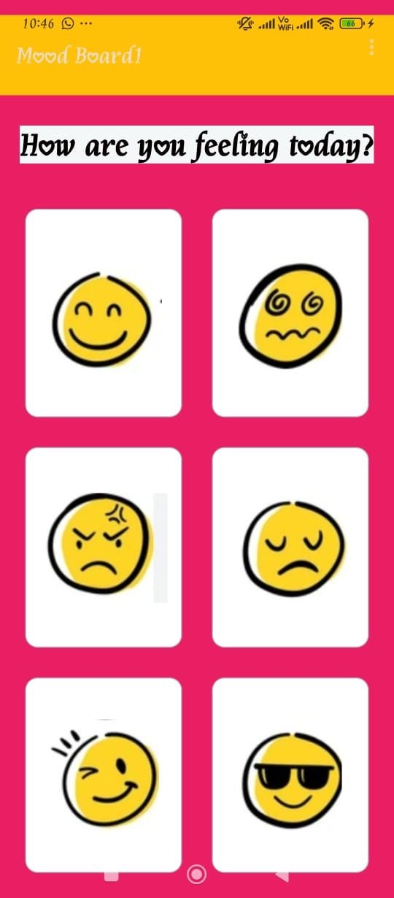
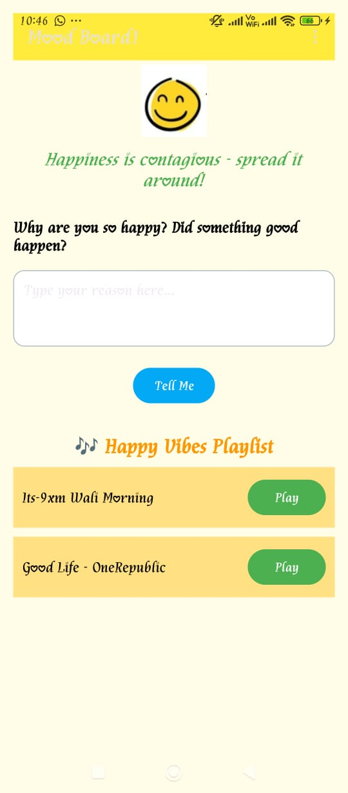
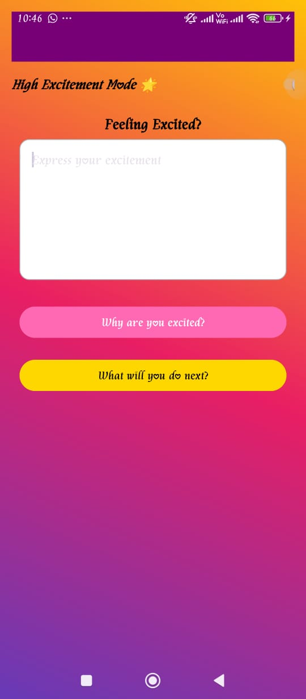
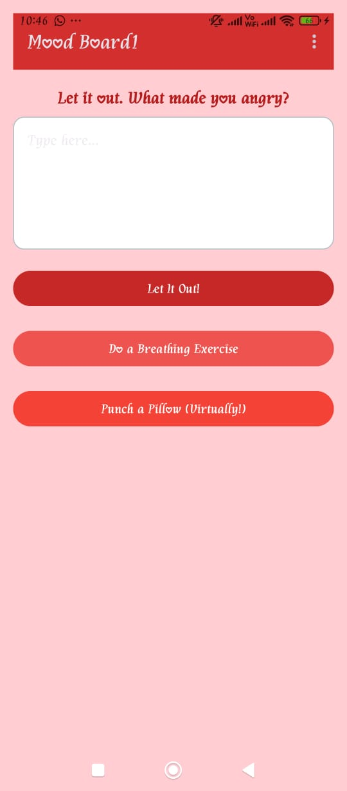
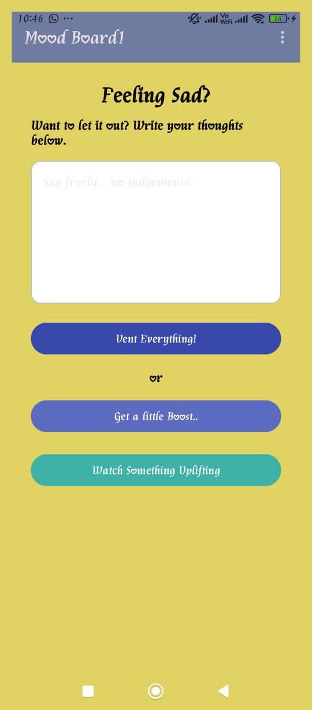
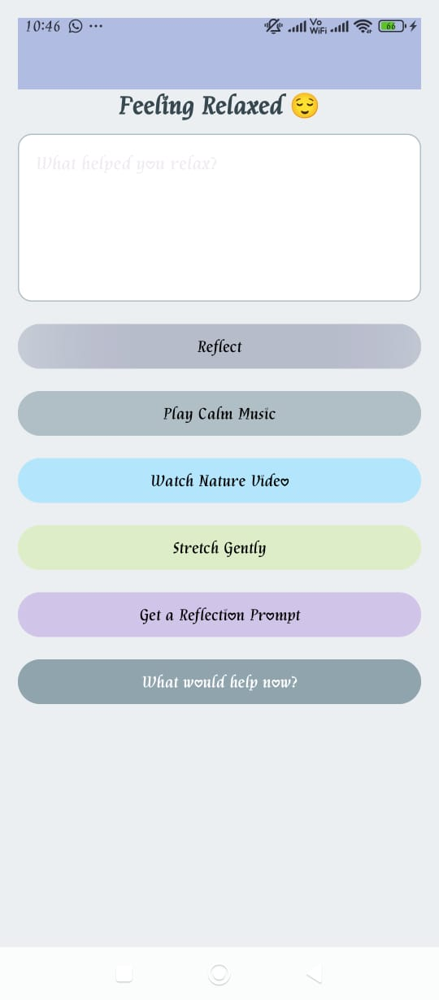
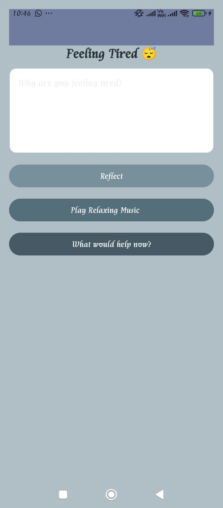

# 🌟 Mood Board App

An expressive and interactive **Android app** built using **Kotlin and XML** that allows users to select their current **mood** and explore a custom-designed activity tailored for that emotional state.

---

## 😄 Available Moods

| Mood     | Description                                          |
|----------|------------------------------------------------------|
| 😄 Happy | Bright layout, cheerful vibe                         |
| 😢 Sad   | Calm interface, soothing tone                        |
| 😡 Angry | Intense theme, high-energy colors                    |
| 😴 Tired | Soft visuals, resting mood                           |
| 😌 Relaxed | Chill layout with subtle tones                     |
| 🤩 Excited | Dynamic animations, color transitions, emojis      |

Each mood launches its **own activity** with animations, transitions, and distinct styles.

---

## ✨ Features

- 🎭 **Mood-specific Activities**: Unique UI/UX for each mood.
- 🌈 **Excited Mode Enhancements**: Switch-controlled background changer and emoji pop-in animations.
- 🧭 **Smooth Navigation**: Uses `fadein` and `fadeout` animations for activity transitions.
- 📲 **Easy Interaction**: Mood selection with large `ImageButton`s for intuitive control.

---

## 🖼️ Screenshots

> Add your screenshots to a `screenshots/` folder or use image URLs.

| Mood Board Home | Happy Mood | Excited Mood | Angry Mood | Sad Mood | Relaxed Mood | Tired Mood |
|-----------------|-------------|---------------|-------------|-----------|----------------|-------------|
|  |  |  |  |  |  |  |

---

## 🔧 Tech Stack

- **Kotlin**
- **Android SDK**
- **XML Layouts (ConstraintLayout, LinearLayout)**
- **Android Animation XML (`fadein`, `fadeout`, `pop_in`)**
- **ImageButton, Switch, Toolbar, Toasts**

---

## 🚀 How to Run

1. **Clone the repo**:
   ```bash
   git clone https://github.com/Anchalshukla145/Mood-Board.git
   ```
2. **Open in Android Studio**
3. **Run the app** on an emulator or connected Android device or Via Usb tethering

---

## 📁 Project Structure (simplified)

```
MoodBoard1/
├── app/
│   ├── java/com/example/moodboard1/
│   │   ├── MainActivity.kt
│   │   ├── Angry.kt, Happy.kt, Sad.kt, Tired.kt, Relaxed.kt, Excited.kt
│   ├── res/
│   │   ├── layout/
│   │   ├── drawable/
│   │   ├── anim/
├── screenshots/
│   ├── home.png, happy.png, etc.
├── README.md
```

---

## 🤝 Contribution

Want to add more moods or animations?  
Fork the repo and open a pull request. Suggestions are welcome!

---

## 📝 License

This project is open source. Feel free to use and Contribute.

---

## 👩‍💻 Author

Made with ❤️ by [Anchal Shukla](https://github.com/Anchalshukla145)
